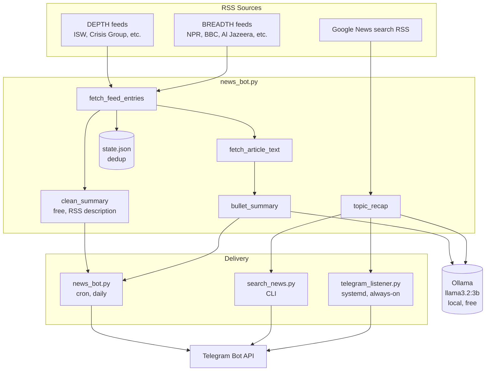

# UpNews

A personal, self-hosted news system delivered over Telegram. It reads from
public RSS feeds, condenses what it finds using a locally-run LLM, and
delivers two things: a daily digest covering global news at both depth and
breadth, and an on-demand topic search you can trigger by messaging a bot.

No paid APIs, no subscriptions, no data leaving the server it runs on.

## Contents

- [What it does](#what-it-does)
- [How summarization works](#how-summarization-works)
- [Architecture](#architecture)
- [Setup](#setup)
- [Running it in production](#running-it-in-production)
- [Configuration reference](#configuration-reference)
- [Project structure](#project-structure)
- [Customizing sources](#customizing-sources)
- [Design decisions and known limitations](#design-decisions-and-known-limitations)

## What it does

### Daily digest (`news_bot.py`)

One message a day, split into two sections:

- **DEPTH** — specialist analysis across four lenses (Military & Security,
  Economy & Finance, Technology, Science), pulled from outlets like ISW,
  Crisis Group, Breaking Defense, MIT Technology Review, and ScienceDaily.
- **BREADTH** — top headlines from six regions, so no part of the world is
  invisible: North America (NPR), Europe (BBC), Middle East (Al Jazeera),
  Africa (BBC Africa), Asia-Pacific (Channel News Asia), Latin America
  (MercoPress).

Every item is capped at 3 per lens/region — enough to stay aware without
either section burying the other. Every item also carries a short, factual
summary (see below) instead of a bare link, and a `state.json` file tracks
what's already been sent so the same story never repeats.

### On-demand topic search (`search_news.py`, `telegram_listener.py`)

Message the bot any topic — "Iran vs US", "Jeffrey Epstein", anything — and
get back a **synthesized recap**, not a list of near-duplicate headlines.
The bot pulls ~20 recent headlines on the topic from Google News, then asks
the local LLM to merge overlapping coverage into 4-6 bullet points on what's
actually going on. `telegram_listener.py` runs continuously so this works
by just messaging the bot at any time; `search_news.py` is the same feature
from the command line, with an optional `--telegram` flag.

## How summarization works

Two separate mechanisms, layered so the system degrades gracefully rather
than breaking:

**1. Free RSS-description extraction** (`clean_summary()` in `news_bot.py`)
Most RSS feeds already include a one-sentence human-written description
alongside each headline. This is stripped of HTML, unescaped, and truncated
— zero cost, no network calls beyond the feed fetch itself. Google News
feeds are the exception: their `<summary>` field is a list of links to
other outlets' coverage, not real article text, so this is detected and
skipped rather than shown as garbled text.

**2. Local LLM summarization via Ollama** (`bullet_summary()` and
`topic_recap()` in `news_bot.py`)
For the daily digest, each article's real page is fetched and its text
extracted, then sent to a small model running locally via
[Ollama](https://ollama.com) (`llama3.2:3b` by default) with instructions
to return 2-3 short, punchy, factual bullet points — no outside knowledge,
no invented facts. For topic search, since Google News article pages can't
be reliably fetched (see [Design decisions](#design-decisions-and-known-limitations)),
the model instead synthesizes a recap directly from the batch of headlines
returned by the search.

Every LLM call has a bounded timeout and is wrapped so a failure — Ollama
not running, a timeout, an empty response — falls back silently to the
free RSS summary (digest) or a plain headline list (search). **Nothing an
LLM does can break message delivery.**

Running the model locally rather than through a paid API means: no per-call
cost, no external service dependency, and no article content or search
topics ever leave the server.

## Architecture



## Setup

### 1. Install dependencies

```bash
git clone git@github.com:atefawaz/UpNews.git
cd UpNews
python3 -m venv venv
./venv/bin/pip install -r requirements.txt
```

### 2. Install Ollama and pull a model

```bash
curl -fsSL https://ollama.com/install.sh | sh   # Linux; use `brew install ollama` on macOS
ollama pull llama3.2:3b
```

`llama3.2:3b` needs roughly 3-4 GB of RAM to run. On a smaller box, pull
`llama3.2:1b` instead and set `OLLAMA_MODEL=llama3.2:1b` in `.env` (see
[Configuration reference](#configuration-reference)). If Ollama isn't
installed or isn't running, the system still works — it just falls back to
the free RSS-description summaries everywhere an LLM summary would go.

### 3. Get a Telegram bot token

- Message [@BotFather](https://t.me/BotFather) on Telegram
- Send `/newbot` and follow the prompts
- Copy the token it gives you

### 4. Get your chat ID

- Message your new bot once (anything)
- Visit `https://api.telegram.org/bot<YOUR_TOKEN>/getUpdates`
- Find `"chat":{"id": ...}` in the response — that's your chat ID

### 5. Configure secrets

Create a `.env` file (gitignored, never committed):

```
TELEGRAM_BOT_TOKEN=your_bot_token_here
TELEGRAM_CHAT_ID=your_chat_id_here
```

### 6. Run it once to test

```bash
set -a; source .env; set +a
./venv/bin/python3 news_bot.py
```

## Running it in production

Deployed on a small always-on Ubuntu server (Hetzner, 4 GB RAM):

**Daily digest** — a cron job runs `news_bot.py` once a day:

```
TZ=Asia/Beirut
0 8 * * * cd /opt/UpNews && /bin/bash -c "set -a; source .env; set +a; ./venv/bin/python3 news_bot.py" >> /var/log/upnews-digest.log 2>&1
```

**On-demand search** — `telegram_listener.py` runs continuously as a
systemd service (`upnews-search.service`):

```
systemctl status upnews-search.service   # check it's running
journalctl -u upnews-search.service -f   # watch logs live
```

**Deploying an update:**

```bash
cd /opt/UpNews
git pull origin main
./venv/bin/pip install -r requirements.txt   # only needed if deps changed
systemctl restart upnews-search.service      # picks up new code — cron
                                              # already re-runs news_bot.py fresh each time
```

## Configuration reference

All configuration is via environment variables (set in `.env`, or exported
before running):

| Variable | Required | Default | Purpose |
|---|---|---|---|
| `TELEGRAM_BOT_TOKEN` | Yes | — | Bot token from @BotFather |
| `TELEGRAM_CHAT_ID` | Yes | — | Your numeric Telegram chat ID |
| `OLLAMA_URL` | No | `http://localhost:11434` | Where Ollama's API is reachable |
| `OLLAMA_MODEL` | No | `llama3.2:3b` | Model to use for summarization |

## Project structure

```
UpNews/
├── news_bot.py           # Daily digest + shared summarization logic
│                          #   (fetch, dedupe, clean_summary, bullet_summary,
│                          #   topic_recap, Telegram send)
├── search_news.py         # CLI: search a topic on demand, optional --telegram flag
├── telegram_listener.py   # Always-on: replies to any message with a topic recap
├── requirements.txt        # Python dependencies
├── .gitignore               # keeps secrets and local state out of git
└── state.json                # local, gitignored — tracks what's already been sent
```

`search_news.py` and `telegram_listener.py` both import their core logic
(`clean_summary`, `bullet_summary`, `topic_recap`, `send_chunked`, etc.)
from `news_bot.py` rather than duplicating it.

## Customizing sources

Edit the `DEPTH_FEEDS` and `BREADTH_FEEDS` dictionaries at the top of
`news_bot.py`. Each is just a list of RSS feed URLs — add or remove freely.
If a feed stops returning items, open its URL in a browser to confirm it
still resolves.

**Prefer direct outlet feeds over Google News RSS** wherever possible.
Google News stuffs its `<summary>` field with a list of links to other
outlets rather than real article text, and its article links only resolve
through an obfuscated consent/redirect wall — so entries from it never get
a free RSS summary (`clean_summary()` detects and skips this), and their
article pages can't be fetched for LLM summarization either.

## Design decisions and known limitations

- **Why local LLM instead of a cloud API (e.g. OpenAI, Groq)?** A cloud
  free tier is someone else's business decision — limits get tightened,
  cards become required, services get discontinued. Running Ollama locally
  has none of that risk: it's free indefinitely, keeps data on the server,
  and has no rate limits. The tradeoff is speed on modest hardware, which
  is acceptable here since both the digest (a daily batch job) and search
  (a few-second wait is fine for an on-demand Telegram reply) are not
  latency-critical.
- **Why can't search results get LLM-summarized from full article text
  like the digest does?** Google News' article links (`news.google.com/rss/articles/...`)
  don't resolve to the actual article — they redirect through an
  obfuscated Google consent/interstitial page. This was confirmed directly
  (fetching one returns a `consent.google.com` page, not the article) and
  ruled out as a dependency: decoding it would require an undocumented,
  unofficial trick that could break without warning if Google changes it.
  Search recaps instead synthesize from the batch of headlines Google News
  returns, which carries real signal (specific facts, named entities) even
  without full article bodies — verified by tracing every claim in sample
  recaps back to an actual headline.
- **Ollama cold starts.** Ollama unloads an idle model from memory after a
  few minutes to save RAM. The daily digest doesn't notice this (its first
  of ~30 back-to-back calls warms the model for the rest), but the search
  bot's on-demand, sporadic calls would hit a slow reload nearly every
  time. This is mitigated with a 90-second timeout (generous enough to
  cover a cold start) and `keep_alive: 30m` on every request, so the model
  stays resident through a burst of activity.
- **Feed reliability.** Specialist feed URLs (ISW, Crisis Group, etc.) were
  sourced from research, not continuously monitored — if one stops
  returning entries, open it in a browser to confirm it still resolves.
  No single feed failure can crash a run; `fetch_feed_entries()` catches
  and logs per-feed errors and continues.
- **Access control.** `telegram_listener.py` only responds to messages
  from the chat ID configured in `.env` — messages from anyone else who
  finds the bot's username are silently ignored.
